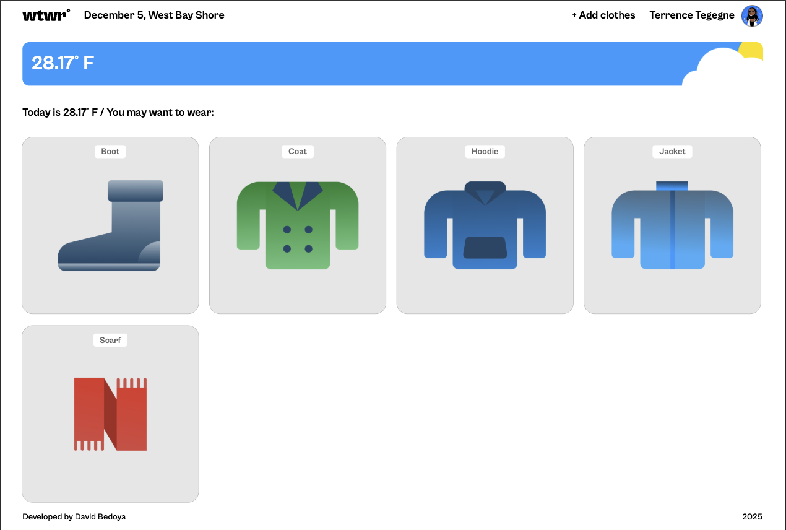
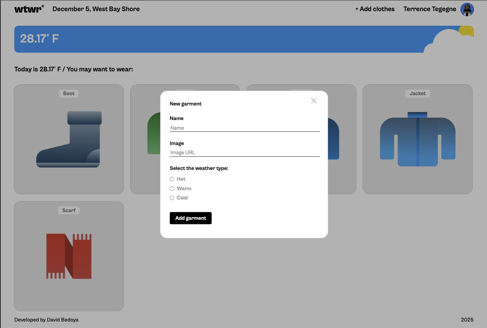
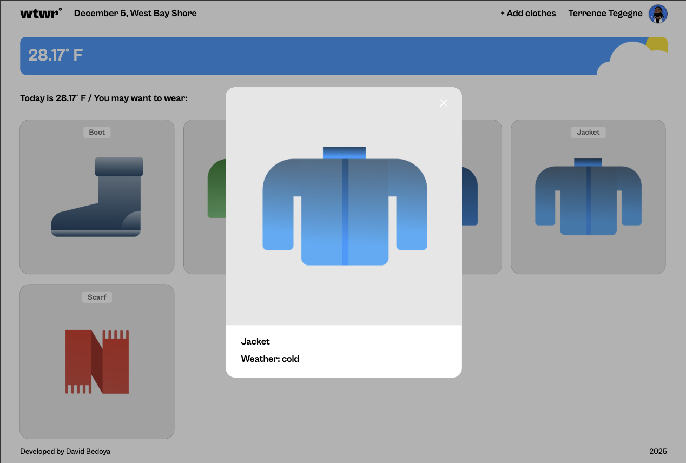

# WTWR (What To Wear) — React

WTWR ("What To Wear") is a weather-based wardrobe app built in React. The app fetches real-time weather data for a chosen location and suggests clothing items based on temperature.

## Overview & Functionality :

As part of Sprint 10 in the TripleTen Software Engineering program, this project involved rebuilding the WTWR layout using React + Vite, and implementing essential functionality such as:

- Fetching weather data from the OpenWeather API
- Displaying the current date and city
- Filtering clothing items by temperature conditions
- Opening and closing modal windows
- Passing data through multiple components
- Managing global UI state (selected card, active modal, etc.) from the App component

## Features :

- Display today’s **date** and **current city**
- Fetch real-time weather data from the **OpenWeather API**
- Show the current temperature in **°F**
- Suggest clothing items based on weather type (`hot`, `warm`, `cold`)
- Click a clothing item to open a detailed item modal
- Open a form modal to add a new garment (name, image URL, weather type)

## Technologies :

- **React** (functional components + hooks)
- **Vite** (fast bundler/dev server)
- **JavaScript (ES6+)**
- **CSS** (BEM-style, component-level styles)
- **Fetch API** for weather requests
- **Prettier** for code formatting
- **Normalize.css**
- **Custom fonts** from the UI Kit

## Project Structure :

A quick overview of the main folders:

- `/src/components` — React components (`App`, `Header`, `Main`, `Footer`, `WeatherCard`, `ItemCard`, `ItemModal`, `ModalWithForm`)
- `/src/utils` — default clothing data, weather helpers, and constants
- `/src/vendor` — fonts, `normalize.css`, and `fonts.css`
- `/src/index.css` — global styles
- `/src/main.jsx` — app entry point

## Demo Video & Screenshots :

- Desktop View - 1440px Width: 

- Add Garment View - 1440px width: 

- Item Card View - 1440px width: 

**Demo Video:**
A full walkthrough video will be added here after completing all frontend sprints.

- [Screen recording](_PlaceHolder To be added soon_)

## GitHub Pages :

- [Github Link](_PlaceHolder To be added soon_)

## Disclaimer :

This is a **frontend-only** version of WTWR. Future sprints will expand the project with login, likes, item creation with a backend, and more advanced features.
